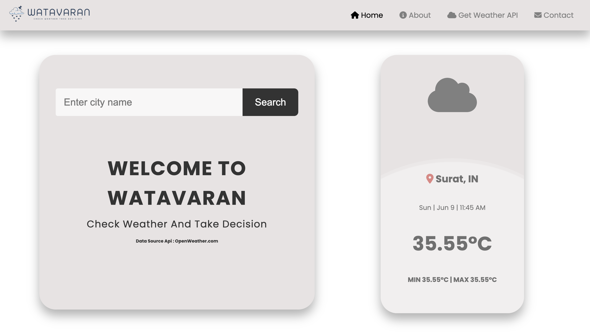

# Watavaran: A Powerful Weather App (Built with Node.js and Modern NPM Modules)

Watavaran is a feature-rich weather application built with Node.js, offering a seamless user experience and access to real-time weather information. Its sleek and modern design empowers users to stay informed about current conditions and upcoming forecasts.

**Key Features:**

- **Precise Weather Data:** Watavaran leverages Node.js's asynchronous capabilities to efficiently fetch weather data from reliable sources like OpenWeatherMap, ensuring you have the latest information at your fingertips.
- **Intuitive Interface:** The user interface is meticulously crafted for simplicity and clarity, enabling you to find the weather details you need quickly.
- **Current & Forecast:** View real-time weather conditions (temperature, wind speed, humidity, etc.) alongside a detailed forecast for the next several days.
- **Location Search:** Effortlessly search for weather conditions in any city globally by simply entering its name.
- **Visually Appealing Design:** Watavaran boasts an aesthetically pleasing design that incorporates subtle animations and a color scheme that reflects the current weather conditions, enhancing the user experience.
- **Contact Us:** Reach out to the Watavaran team for feedback, suggestions, or questions through the integrated contact form.

**Technical Underpinnings:**

- **Backend:** Node.js: Chosen for its robust capabilities in handling asynchronous tasks like fetching weather data.
- **Frontend:** HTML, CSS, and JavaScript: Form the foundation for the user interface's structure, styling, and interactivity.
- **NPM Modules:**
    - **axios (or a modern alternative):** Employed to make HTTP requests to OpenWeatherMap's API, retrieving the weather data. Axios is a popular and actively maintained alternative to the deprecated `requests` module.
    - **Express (or a similar framework, optional):** Can be implemented to streamline server-side routing and API interactions (if applicable).
- **OpenWeatherMap API:** Provides trustworthy real-time weather information for various locations.

**Development and Contribution:**

- **Getting Started:**
    1. Clone this repository.
    2. Install the required dependencies using `npm install`. Refer to `package.json` for specific details.
    3. Start the development server with `npm start`. This typically launches the application on `http://localhost:3000` (port may vary).
- **Contributing:** We encourage contributions! Fork the repository and submit pull requests with your improvements.
- **Contact:** Your feedback and suggestions are valuable. Use the contact form on the website or create an issue on this repository to connect with us.

**License:**

This project is distributed under the MIT License, offering you flexibility for personal and commercial use.
